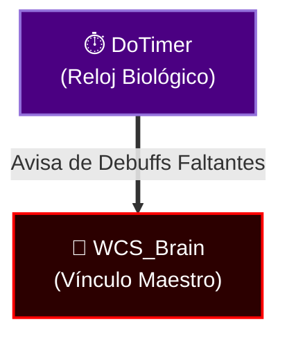

# DoTimer (Edición El Séquito del Terror)

DoTimer es un gestor avanzado de "Damage over Time" (DoTs), "Healing over Time" (HoTs) y Cooldowns. Esta versión incluye un motor de traducción **nativo** único para una compatibilidad total con clientes en español e inglés sin impactar en absoluto tu Combat Log.

## 🚀 Características Principales

*   **Rastreo Multi-Objetivo**: Muestra temporizadores de tus hechizos en múltiples enemigos simultáneamente.
*   **Zero-Hooks Localization**: Funciona perfectamente en clientes en Español (esES/esMX) gracias a la base de datos interna `DoTimer_SpellLocalization` inyectada con seguridad de Nulos.
*   **Crash-Free Ghost Timers**: Temporizadores fantasma reconstruidos desde cero para nunca emitir errores Lua.
*   **Estética Séquito**: Textos `<Shadow>` integrados, interfaz semi-transparente premium, fondos sombreados nativos.
*   **Integración de IA**: Permite que `TerrorSquadAI` lea tus DoTs para sugerirte la rotación óptima.

## 🎮 Guía de Uso

Simplemente lanza tus hechizos. DoTimer creará automáticamente barras de tiempo para Debuffs, Buffs y Cooldowns.

### Comandos de Chat
*   `/dotimer` - Abre el panel de configuración principal.
*   `/dotimerspells` - **[NUEVO]** Muestra la lista de hechizos y verifica el estado de la traducción activa en la base de datos.
*   `/dotimer anchor` - Muestra/Oculta los anclajes para mover las barras.

## 🌐 Integración Terror Ecosystem
DoTimer actúa como los "ojos" de `TerrorSquadAI`. Coordina y procesa tiempos en la interfaz permitiendo renovaciones de DoTs analíticas.

### 🌐 Séquito Ecosystem Compatible (SquadMind Clock)
Como el **Reloj Biológico** del escuadrón, `DoTimer Edition Séquito` rastrea los DoTs/HoTs y se comunica con la Red Neural:

Permite que la IA de `WCS_Brain` analice el combate y ajuste automáticamente las rotaciones de Curses y DoTs del clan para una eficiencia de DPS perfecta.

*Modificado por DarckRovert para El Séquito del Terror.*
*Versión v9.3.0 [God-Tier] — Ecosistema El Séquito del Terror.*
