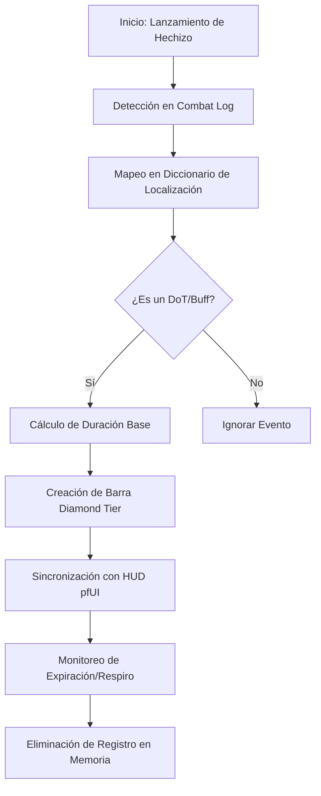

# 📐 Wiki: Arquitectura 'Diamond Tier' — DoTimer [v9.4.0]

Estructura técnica de la persistencia de hechizos mantenida por **DarckRovert**.

## 🏗️ Jerarquía del Sistema Spell Tracker (Magic Hierarchy)

**DoTimer** gestiona la visualización de tiempos mediante una capa de intercepción de eventos de combate:

1.  **Spell Decoder (`SpellSystem/`)**: El motor que analiza el Combat Log para identificar cuándo un hechizo ha sido aplicado, resistido o ha expirado.
2.  **Localization Engine (`DoTimer_SpellLocalization.lua`)**: Diccionario de mapeo de nombres de hechizos para asegurar la compatibilidad entre clientes esES y enUS.
3.  **Timer Visualizer (`DoTimer/`)**: Gestiona la creación y destrucción dinámica de las barras de tiempo.
4.  **Neural Refresher (`DoTimer_Patch.lua`)**: Parche del Séquito para optimizar la renovación de DoTs de alta frecuencia (como Corrupción o Inmolar).

---

## 🧭 Diagrama de Flujo: Seguimiento de DoT v9.4

## ⚡ Estrategias de Ingeniería Diamond Tier

- **Combat Log Hijacking**: DoTimer v9.4 optimiza la cadena de procesamiento de eventos de combate, reduciendo el stuttering en situaciones de lucha masiva (AoE).
- **Asynchronous GUI Update**: El renderizado de las barras se realiza en hilos de actualización asíncronos para no bloquear la entrada de teclado/ratón.
- **Turtle WoW Spell IDs**: El diccionario incluye soporte para los hechizos exclusivos de las nuevas razas y clases del servidor Turtle WoW.

---
© 2026 **DarckRovert** — El Séquito del Terror.
*Precisión mágica para la conquista de Azeroth.*
